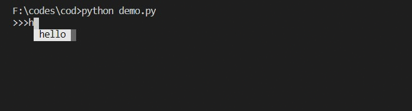

cod
-----
easy to use the click package to add command for a interactive terminal! 

1. support autocompetation
2. support arrow up or down for history command

Installing
-----

Install and update using `pip`:

    pip install -U cod

A Simple Example
-----

    import click

    from cod import main, echo

    @click.option('--name', prompt='Your name',
                help='The person to greet.')
    @click.command()
    def hello(name):
        echo(name)

    main()

------

